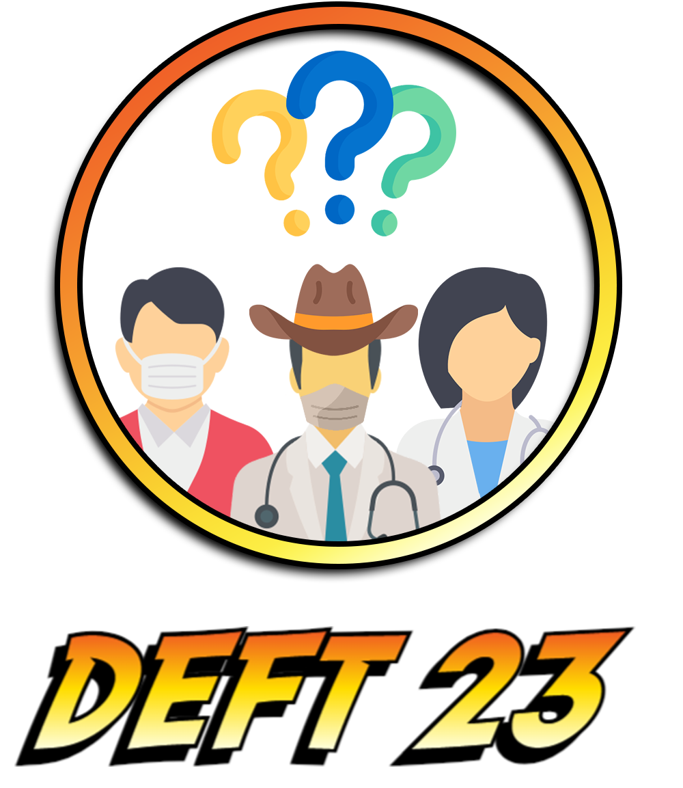

<h1 align="center">DÉfi Fouille de Textes (DEFT) 2023 @ TALN 2023</h1>

<p align="center">
  
</p>

<h3 align="center">DEFT 2023: French Pharmacy Exam Multiple-Choice Question Answering</h3>

The workshop is based around the first publicly available Multiple-Choice Question Answering (MCQA) dataset in French for medical domain called FrenchMedMCQA. It is composed of 3,105 questions taken from real exams of the French medical specialization diploma in pharmacy, mixing  single  and multiple answers.

[](https://opensource.org/licenses/Apache-2.0)

## Dataset Description

|                        | Links                                               | 
| :--------------------: |:---------------------------------------------------:|
| **Homepage:**          |  https://github.com/qanastek/DEFT-2023              | 
| **Repository:**        |  https://github.com/qanastek/DEFT-2023              | 
| **Paper:**             |  https://hal.archives-ouvertes.fr/hal-03824241v1    | 
| **Leaderboard:**       |  Coming Soon                                        |
| **Point of Contact:**  |  [deft-2023@listes.univ-avignon.fr](mailto:deft-2023@listes.univ-avignon.fr)|

## Dataset Summary

FrenchMedMCQA is the first open-source Multiple-Choice Question Answering (MCQA) dataset which propose questions with a single or multiple answer(s) based on real-world medical exam questions.

## Languages

The questions and answers are available in French.

## Dataset Structure

### Data Instances

Example of a question with multiple answers.

In JSON format:

```json
{
    "id": "6979d46501a3270436d37b98cf351439fbcbec8d5890d293dabfb8f85f723904",
    "question": "Cocher la (les) proposition(s) exacte(s)\u00a0: Le m\u00e9tronidazole\u00a0:",
    "answers": {
        "a": "Est un d\u00e9riv\u00e9 du pyrazole",
        "b": "Peut induire un effet antabuse",
        "c": "Peut \u00eatre administr\u00e9 par voie parent\u00e9rale intraveineuse",
        "d": "Peut \u00eatre utilis\u00e9 dans certaines parasitoses \u00e0 protozoaires",
        "e": "Est inefficace dans les infections \u00e0 germes ana\u00e9robies"
    },
    "correct_answers": [
        "b",
        "c",
        "d"
    ],
    "subject_name": "pharmacie",
    "type": "multiple",
    "nbr_correct_answers": 3
}
```

In TSV format:

```plain
id	question	answers.a	answers.b	answers.c	answers.d	answers.e	correct_answers	nbr_correct_answers
6979d46501a3270436d37b98cf351439fbcbec8d5890d293dabfb8f85f723904	Cocher la (les) proposition(s) exacte(s) : Le métronidazole :	Est un dérivé du pyrazole	Peut induire un effet antabuse	Peut être administré par voie parentérale intraveineuse	Peut être utilisé dans certaines parasitoses à protozoaires	Est inefficace dans les infections à germes anaérobies	b|c|d	3
```


### Data Fields

- `id` : Question identifier
- `question` : Question text
- `answers` : The list of 5 options from A to E
- `correct_answers` : Correct option(s) (Can be one or more answer(s) to the question)
- `subject_name` : Medical field treated by the question
- `type` : The type of question is `single` (one correct answer only) or `multiple` (multiple correct answers)
- `nbr_correct_answers` : The number of correct answers

### Data Splits

Globally, 70 % of the questions are kept for the train, 10 % for validation and the last 20 % for testing.

The distribution of the subsets according to the number of answers are as follow :

| # Answers | Training   | Validation | Total     |
| --------- | ---------- | ---------- | --------- |
| 1         | 595        | 164        | **1,080** |
| 2         | 528        | 45         | **670**   |
| 3         | 718        | 71         | **930**   |
| 4         | 296        | 30         | **382**   |
| 5         | 34         | 2          | **43**    |
| Total     | **2171**   | **312**    | **3,105** |


## Bootstrapping training scripts

### Architecture

We are providing a basic bootstrapping script for training, which use [Transformers library](https://huggingface.co/docs/transformers/index) to train a `CamemBERT-base` model to predict the correct(s) answer(s) to the question by modeling it as a *multi-label* problem.

P.-S.: It's not the training script of the reference, and had the only purpose to make easier to start with the tasks.

How to use the training scripts (each file header contains the full procedure):
- Change the path of the HuggingFace dataset to your local or remote location.
   - My local path: `dataset_base  = load_dataset("/users/ylabrak/DEFT-2023/Data/Huggingface/DEFT-2023/DEFT2023.py")`
   - Using HuggingFace Hub (required to send an invitation to [DEFT-2023 organization](https://huggingface.co/DEFT-2023) or your HuggingFace username to the workshop email): `dataset_base = load_dataset("DEFT-2023/DEFT2023", use_auth_token=True)`
- Run the training script:
   - `python TrainFrenchMedMCQA-CLASSIFICATION-Full.py --model_name="camembert-base"`
   - `python TrainFrenchMedMCQA-QA.py --model_name="camembert-base"`

## Evaluation scripts

Run the evaluation script:
- Classification: `python EvaluationClassification.py --references="./references_classification.txt" --predictions="./sample_classification.txt"`
- MCQA: `python EvaluationQA.py --references="./references_qa.txt" --predictions="./sample_qa.txt"`

### Citation Information

We would very much appreciate it if you cite our publications :

```bibtex
@unpublished{labrak:hal-03824241,
  TITLE = {{FrenchMedMCQA: A French Multiple-Choice Question Answering Dataset for Medical domain}},
  AUTHOR = {Labrak, Yanis and Bazoge, Adrien and Dufour, Richard and Daille, B{\'e}atrice and Gourraud, Pierre-Antoine and Morin, Emmanuel and Rouvier, Mickael},
  URL = {https://hal.archives-ouvertes.fr/hal-03824241},
  NOTE = {working paper or preprint},
  YEAR = {2022},
  MONTH = Oct,
  PDF = {https://hal.archives-ouvertes.fr/hal-03824241/file/LOUHI_2022___QA-3.pdf},
  HAL_ID = {hal-03824241},
  HAL_VERSION = {v1},
}
```
